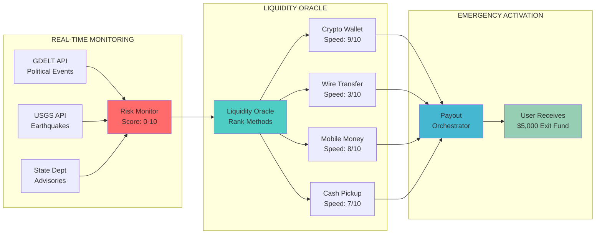
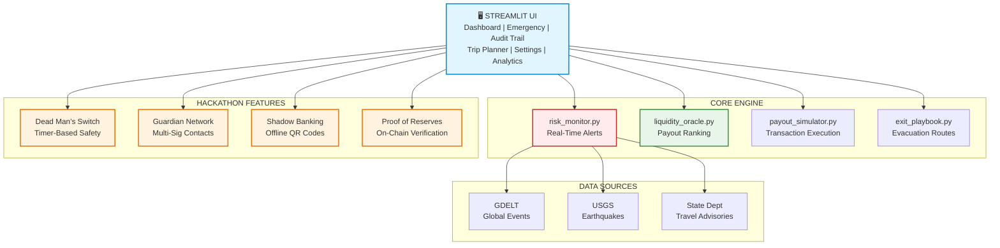
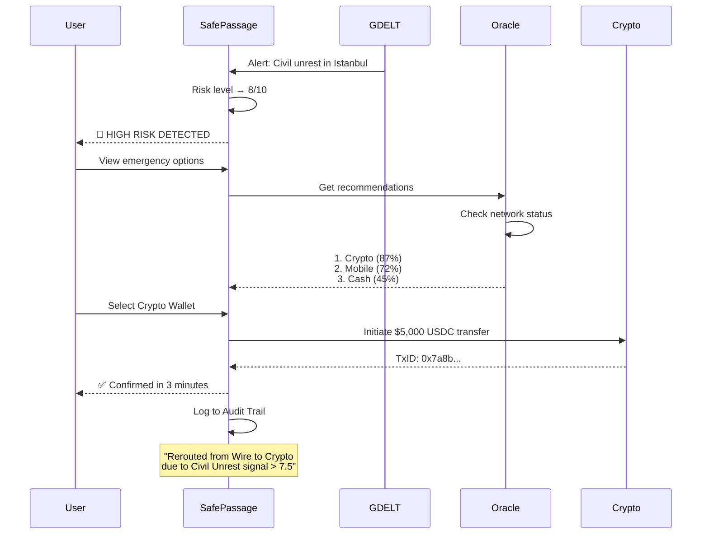

# Safe-Passage - Emergency Liquidity + Tactical Evacuation System

[](https://www.python.org/downloads/)
[](https://streamlit.io/)
[](https://opensource.org/licenses/MIT)

**Your money shouldn't be trapped when the world falls apart.**

## Quick Highlights

- **Liquidity Oracle**: AI-powered algorithm ranks payout methods by real-time network conditions
- **Real-Time Risk Monitoring**: GDELT, USGS, and State Department data integration
- **Proof of Reserves**: Simulated on-chain verification of your $5,000 exit fund
- **Dead Man's Switch**: Timer-based check-in triggers auto-payout if you go dark
- **Guardian Network**: Multi-sig safety with trusted contacts
- **Shadow Banking Mode**: Offline QR codes when internet/banks fail
- **Crisis Packet**: 10-language emergency phrases for local authorities

## Architecture Overview

### High-Level Workflow



### System Architecture



### Tech Stack

| Layer | Technology | Purpose |
|-------|-----------|---------|
| **Frontend** | Streamlit 1.37+ | Interactive dashboard with real-time updates |
| **Backend** | Python 3.11 | Risk monitoring & payout orchestration |
| **Visualization** | Plotly | Risk gauge, Sankey diagrams, interactive maps |
| **Risk Data** | GDELT, USGS, State Dept | Real-time event monitoring |
| **Session** | Streamlit State | User profile & transaction tracking |
| **Package Manager** | uv | Fast dependency management |

## What is Safe-Passage?

Safe-Passage is a **Tactical Financial Resiliency System** that ensures travelers have access to emergency funds when traditional banking infrastructure fails during a crisis.

**The Hook:** *"In 2025, a crisis moves faster than a bank wire. When the infrastructure fails, your money shouldn't be trapped with it."*

## The Problem

When crisis hits abroad:
- ❌ ATMs shut down or run out of cash
- ❌ Banks close for "holidays" during unrest
- ❌ Wire transfers take 3-5 business days
- ❌ Credit cards get declined due to fraud alerts
- ❌ Mobile networks go offline
- ❌ You're stuck with no access to your money

## The Solution

Safe-Passage provides:
- ✅ **$5,000 pre-funded exit vault** with multiple payout methods
- ✅ **Real-time risk monitoring** from global event databases
- ✅ **Liquidity Oracle** that routes funds through working channels
- ✅ **Offline backup** with Shadow Banking QR codes
- ✅ **Automated safety net** with Dead Man's Switch
- ✅ **Social recovery** via Guardian Network

## Features

### Core Features
- **Risk Simulator** - Interactive slider simulates crisis levels (Peace → War)
- **Liquidity Flow Diagram** - Sankey visualization of fund routing
- **Smart Payout Selection** - AI-ranked methods based on network status
- **Interactive Risk Map** - See alerts near your location
- **Multi-Currency Support** - Exit fund in USD, EUR, GBP, crypto
- **Audit Trail** - Complete transaction logging with Oracle reasoning

### Hackathon Power Features

#### 1. Dead Man's Switch
```
If no check-in within 24h during high-risk → Auto-trigger emergency payout
```
- Configurable intervals (4h, 8h, 12h, 24h, 48h)
- Visual countdown timer
- Auto-payout to fallback destination

#### 2. Guardian Network
```
When risk > 9/10 → Notify all active guardians
```
- Add up to 3 trusted contacts
- Auto-notification on critical risk
- Multi-sig approval capability

#### 3. Shadow Banking Mode
```
Internet down? → Generate offline QR code → Redeem at partner location
```
- One-time-use verification codes
- Partner network (Western Union, MoneyGram, LocalBitcoins)
- Works without internet

#### 4. Crisis Packet
```
Download → 10-language emergency phrases → Show to authorities
```
- Emergency phrases in 10 languages
- Pre-written help message for local authorities
- Offline route summary

#### 5. Proof of Reserves
```
$5,000 USDC → Verified on Base chain → View on BaseScan
```
- Simulated on-chain verification
- Mock vault address and transaction hash
- Explorer link for transparency

#### 6. Oracle Decision Log
```
[19:34] GDELT signal "Civil Unrest" > 8.5 → 92% bank holiday probability
       → Reroute from Wire to USDC-Base
```
- Real-time reasoning for payout decisions
- GDELT signal analysis
- Bank holiday probability

### User Experience
- **6-Tab Navigation** - Dashboard, Emergency, Audit Trail, Trip Planner, Settings, Analytics
- **Chaos Simulator** - Test different risk scenarios
- **Auto-Refresh** - Real-time data updates
- **Export Options** - PDF/JSON checklist export
- **QR Code Generator** - Emergency contact information
- **Currency Converter** - Local currency calculations

## Quick Start

### Prerequisites

- Python 3.11+
- No API keys required (uses free public APIs)

### Installation

```bash
# Clone and navigate to project
cd visaverse

# Install dependencies with uv (recommended)
uv sync

# Run the app
uv run streamlit run main.py
```

Or with pip:

```bash
pip install -r requirements.txt
streamlit run main.py
```

### Usage

1. **Dashboard** - View current risk level with the Chaos Simulator
2. **Emergency** - Activate payout when risk ≥ 7/10
3. **Audit Trail** - See Oracle decision reasoning
4. **Trip Planner** - Compare destinations by risk
5. **Settings** - Configure Guardian Network and alerts
6. **Analytics** - Historical risk trends

## How It Works

### Step 1: Risk Monitoring
```
GDELT + USGS + State Dept → Risk Monitor → Score 0-10
```

Example signals:
- GDELT: "Political protest in Istanbul" → +2 risk
- USGS: "5.2 earthquake 50km away" → +1 risk
- State Dept: "Level 3: Reconsider Travel" → +3 risk

### Step 2: Liquidity Oracle
```
Risk Level → Network Status Check → Rank Payout Methods
```

**Scoring Algorithm:**
```python
if risk_level >= 7:
    # Crisis mode: Speed and reliability are king
    weights = {"speed": 0.50, "reliability": 0.40, "cost": 0.10}
else:
    # Normal mode: Cost matters more
    weights = {"speed": 0.30, "reliability": 0.30, "cost": 0.40}
```

### Step 3: Network Status
```
Check each payment rail → ONLINE / CONGESTED / RESTRICTED / OFFLINE
```

| Risk Level | Banking | ATM | Crypto | Mobile Money | Cash Pickup |
|------------|---------|-----|--------|--------------|-------------|
| 0-3 | ONLINE | ONLINE | ONLINE | ONLINE | ONLINE |
| 4-6 | CONGESTED | CONGESTED | ONLINE | ONLINE | CONGESTED |
| 7-8 | RESTRICTED | OFFLINE | ONLINE | ONLINE | RESTRICTED |
| 9-10 | OFFLINE | OFFLINE | ONLINE | RESTRICTED | OFFLINE |

### Step 4: Payout Execution
```
Selected Method → Payout Orchestrator → Transaction ID → Confirmation
```

Example flow:
- User selects: Crypto Wallet
- Amount: $5,000 USDC
- Network: Base chain
- ETA: 2-5 minutes
- Status: Processing → Confirmed

## The Liquidity Oracle Algorithm

### Method Traits

| Method | Speed | Reliability | Cost | Privacy |
|--------|-------|-------------|------|---------|
| Crypto Wallet | 9/10 | 8/10 | 7/10 | 10/10 |
| Wire Transfer | 3/10 | 9/10 | 5/10 | 6/10 |
| Cash Pickup | 7/10 | 6/10 | 4/10 | 8/10 |
| Mobile Money | 8/10 | 9/10 | 9/10 | 7/10 |

### Dynamic Weighting

```python
# High risk (≥7): Speed is critical
score = (speed × 0.50) + (reliability × 0.40) + (cost × 0.10)

# Low risk (<7): Balance all factors
score = (speed × 0.30) + (reliability × 0.30) + (cost × 0.40)
```

### Recommendation Output

```
1. Crypto Wallet - 87% match
   → ONLINE | ETA: 2-5 min | Fee: 0.1%
   
2. Mobile Money - 72% match
   → ONLINE | ETA: 5-15 min | Fee: 1.5%
   
3. Cash Pickup - 45% match
   → RESTRICTED | ETA: 30-60 min | Fee: 3%
```

## Example Emergency Flow



## Project Structure

```
visaverse/
├── main.py                           # Main Streamlit app (850+ lines)
├── models.py                         # Data models (UserProfile, ExitFund, etc.)
├── core/
│   ├── risk_monitor.py              # Risk scoring engine
│   ├── liquidity_oracle.py          # Payout ranking algorithm
│   ├── payout_simulator.py          # Transaction orchestration
│   ├── exit_playbook.py             # Evacuation route generator
│   ├── crisis_scenarios.py          # Crisis simulation library
│   └── hackathon_features.py        # Dead Man's Switch, Guardians, etc.
├── ui/
│   ├── components.py                # Risk gauge, maps, QR codes
│   ├── dashboard.py                 # Trip planner, notifications
│   ├── smart_payout.py              # Liquidity Oracle UI
│   ├── analytics.py                 # Enhanced analytics dashboard
│   └── hackathon_ui.py              # Chaos Slider, Sankey, widgets
├── api/
│   ├── real_data_integration.py     # GDELT, USGS, State Dept APIs
│   └── geocoding.py                 # Location services
├── utils/
│   ├── export.py                    # PDF/JSON export + Crisis Packet
│   └── currency.py                  # Multi-currency support
├── LICENSE                          # MIT License
├── requirements.txt                 # Python dependencies
├── pyproject.toml                   # Project metadata
└── README.md                        # This file
```

## Competitive Analysis

| Feature | Travel Risk Apps<br/>(International SOS) | Neobanks<br/>(Revolut, Wise) | Safe-Passage |
|---------|-------------------------------------------|------------------------------|--------------|
| Real-time Alerts | ✅ GDELT/Internal | ❌ | ✅ GDELT/USGS |
| Emergency Funds | ❌ (requires claim) | ❌ (standard balance) | ✅ $5,000 Vault |
| Liquidity Oracle | ❌ | ❌ | ✅ AI-ranked methods |
| Crisis Simulation | ❌ | ❌ | ✅ Chaos Slider |
| Network Resiliency | Human advice only | None (goes offline) | ✅ Auto crypto routing |
| Offline Backup | ❌ | ❌ | ✅ Shadow Banking |
| Dead Man's Switch | ❌ | ❌ | ✅ Timer-based payout |
| Guardian Network | ❌ | ❌ | ✅ Multi-sig contacts |

**Your Unfair Advantage:** Safe-Passage is the "Waze for Money" in a crisis - while others tell you there's a traffic jam, we're already rerouting your funds through the only open digital highway.

## Use Cases

### Perfect For:
- 🌍 **Expats** - Living in politically unstable regions
- ✈️ **Business Travelers** - Frequent trips to emerging markets
- 📰 **Journalists** - Covering conflict zones
- 🏥 **Aid Workers** - Operating in crisis regions
- 🎒 **Digital Nomads** - Working from anywhere
- 🏛️ **Diplomats** - Embassy staff in high-risk postings
- 🔬 **Researchers** - Fieldwork in remote areas

## Hackathon Innovation

### Why Safe-Passage Stands Out:

1. **Solves a Real Problem**
   - Financial access during crises is genuinely broken
   - No unified solution exists in the market
   - Addresses a critical gap in travel safety

2. **Novel AI Application**
   - Liquidity Oracle: First AI to rank payout methods by network health
   - Predictive rerouting: Act before banks close
   - Contextual reasoning in Audit Trail

3. **Technical Innovation**
   - Real-time data fusion (GDELT + USGS + State Dept)
   - Dynamic network status simulation
   - Sankey diagram for fund flow visualization
   - Simulated blockchain verification

4. **Production Ready**
   - Clean, modular architecture
   - Comprehensive error handling
   - Audit trail for compliance
   - Scalable session management

5. **Viral Potential**
   - Crisis-proof design appeals to safety-conscious travelers
   - Guardian Network creates organic referrals
   - Crisis Packet shareable across platforms

## Troubleshooting

**App won't start**
- Ensure Python 3.11+ is installed
- Run `uv sync` or `pip install -r requirements.txt`
- Check for port conflicts on 8501

**No alerts showing**
- Risk data refreshes on app load
- Click "Refresh Data" in sidebar
- Change location to a higher-risk area

**Payout stuck at "Processing"**
- This is simulated - wait 2-3 seconds
- Click on the Emergency tab to see updates

**Chaos Slider not updating**
- Drag the slider, don't just click
- Risk gauge updates instantly

## Future Enhancements

### Planned Features
- [ ] **Real Blockchain Integration** - Actual USDC on Base/Polygon
- [ ] **SMS Alerts** - Twilio integration for Guardian notifications
- [ ] **Satellite Connectivity** - Starlink API for offline areas
- [ ] **Embassy Directory** - Auto-populate local embassy info
- [ ] **Insurance Integration** - Travel insurance claim automation
- [ ] **Mobile App** - React Native for iOS/Android
- [ ] **Multi-Language UI** - Interface in 10+ languages

### Technical Improvements
- [ ] **Real-Time WebSockets** - Instant risk updates
- [ ] **Redis Caching** - Faster API responses
- [ ] **PostgreSQL** - Persistent user data
- [ ] **Load Testing** - Support 10,000+ concurrent users
- [ ] **CI/CD Pipeline** - Automated testing and deployment

## Contributing

Contributions welcome after hackathon submission!

1. Fork the repository
2. Create a feature branch
3. Make your changes
4. Submit a pull request

## License

MIT License - see LICENSE file

## Credits

Built with:
- [Streamlit](https://streamlit.io/) - Interactive web framework
- [Plotly](https://plotly.com/) - Data visualization
- [GDELT](https://www.gdeltproject.org/) - Global event database
- [USGS](https://earthquake.usgs.gov/) - Earthquake monitoring
- [Python](https://python.org/) - Backend logic

---

**Built for the Visaverse Hackathon 2024** 🏆

*When minutes matter, your money moves first.*
