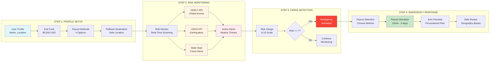
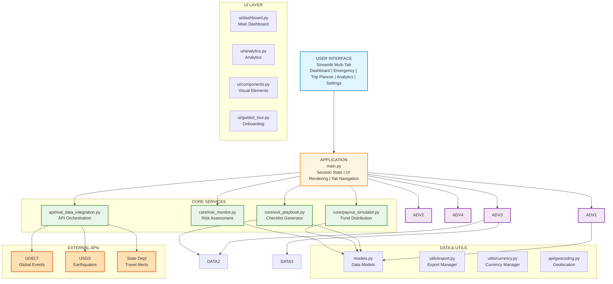
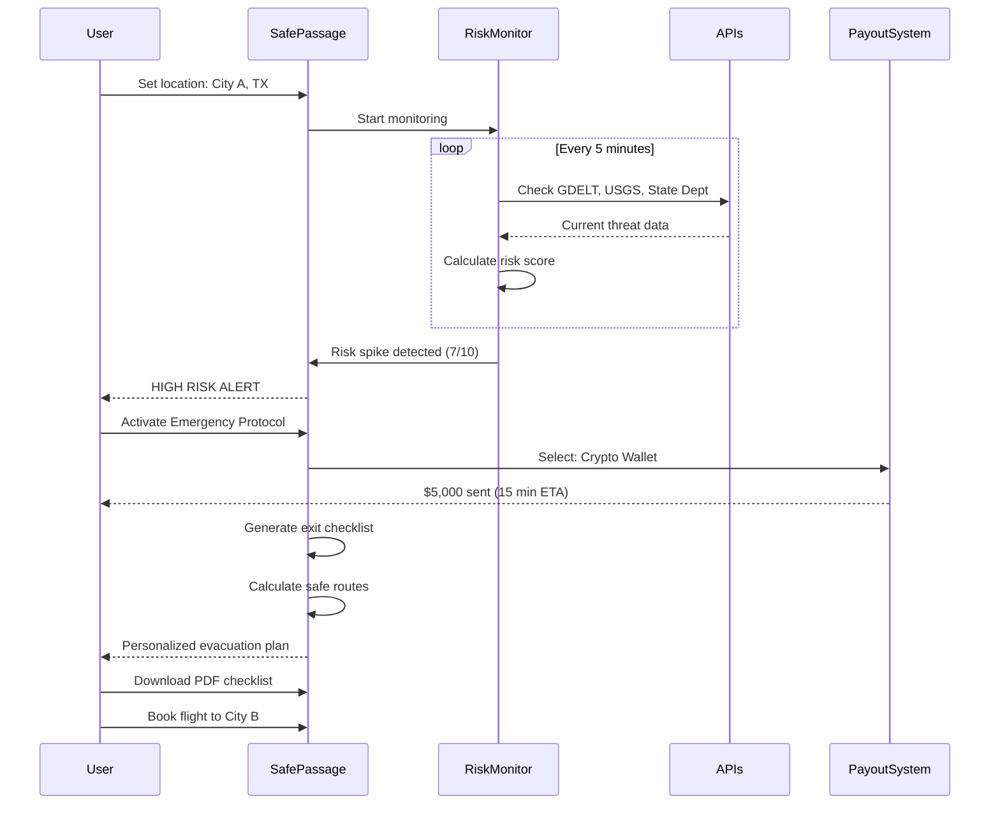

# Safe-Passage - Emergency Liquidity System

[](https://www.python.org/downloads/)
[](https://streamlit.io/)
[]()
[](https://opensource.org/licenses/MIT)

**Emergency exit fund and crisis management platform for travelers, expats, and digital nomads.**

## Quick Highlights

- ** Multi-Currency Exit Fund**: $5,000+ emergency fund with 4 payout methods (crypto, wire, cash, mobile)
- ** 🤖 Smart Liquidity Oracle**: Algorithmic scoring engine that ranks payout methods by speed & safety
- ** Network Simulation**: Realistic simulation of financial network outages (e.g., "Banks Closed")
- ** Real-Time Risk Monitoring**: Live integration with GDELT, USGS, and State Department alerts
- ** Interactive Maps**: Visualize your location, fallback destinations, and nearby threats
- ** Crisis Scenarios**: Pre-built emergency simulations for 5 global hotspots
- ** Smart Trip Planning**: Risk assessment for 30+ countries with AI-powered recommendations
- ** Enhanced Analytics**: Historical trends, global heatmaps, and journey timelines
- ** Fast Setup**: Install and run in under 2 minutes with UV

## Architecture Overview

### High-Level Workflow



### System Architecture



### Tech Stack

| Layer               | Technology              | Purpose                          |
| ------------------- | ----------------------- | -------------------------------- |
| **Frontend**        | Streamlit 1.28+         | Interactive multi-tab web UI     |
| **Backend**         | Python 3.9+             | Application logic & services     |
| **Data Viz**        | Plotly 5.17+            | Interactive maps, charts, gauges |
| **APIs**            | GDELT, USGS, State Dept | Real-time risk data              |
| **Validation**      | Pydantic                | Data models & validation         |
| **QR Codes**        | qrcode + Pillow         | Emergency contact sharing        |
| **PDF Export**      | ReportLab               | Checklist downloads              |
| **Package Manager** | uv                      | Fast dependency management       |

## What is Safe-Passage?

Safe-Passage is a **comprehensive emergency preparedness platform** that helps travelers and expats:

1. **Prepare** - Set up emergency exit fund with multiple payout methods
2. **Monitor** - Track real-time risks in your location (political unrest, natural disasters, security threats)
3. **Respond** - Activate emergency protocol with one click
4. **Evacuate** - Follow personalized exit checklist with safe routes

## The Problem

When crisis strikes abroad:
- **No access to funds** - Banks closed, ATMs empty, cards blocked
- **No evacuation plan** - Panic, confusion, poor decisions
- **No situational awareness** - Unaware of nearby threats
- **No safe routes** - Don't know how to get to safety
- **No emergency contacts** - Can't reach embassy or family
- **Time pressure** - Every minute counts in a crisis

## The Solution

Safe-Passage provides:
- **Pre-funded emergency account** with instant access
- **Real-time risk monitoring** from 3 global data sources
- **Automated crisis detection** with severity scoring
- **One-click emergency activation** for rapid response
- **Personalized exit checklist** with prioritized actions
- **Geography-aware safe routes** (no impossible ferry rides!)
- **Multi-currency support** for 8 major currencies
- **Offline-ready exports** (PDF/JSON checklists)

## Features

### Core Functionality
- ** Emergency Exit Fund** - Pre-funded account ($5,000 default) with 4 payout methods
- ** Real-Time Risk Monitor** - Live alerts from GDELT, USGS, State Department
- ** Interactive Location Map** - See your position, fallback destination, and nearby alerts
- ** Crisis Scenarios** - Pre-built simulations (City C, City D, City E, City F, City G)
- ** Trip Risk Assessment** - Evaluate safety for 30+ countries before you go
- ** Risk Gauge** - Speedometer-style visualization (0-10 scale)
- ** Safe Route Generator** - Realistic evacuation routes based on geography

### Advanced Features
- ** QR Code Generator** - Share emergency contact info instantly
- ** Alert System** - Email/SMS notification previews
- ** PDF/JSON Export** - Download checklists for offline access
- ** Emergency Widget** - One-click SOS with quick-dial contacts
- ** Destination Comparison** - Compare risk levels for multiple locations
- ** Multi-Currency Converter** - Real-time exchange rates for 8 currencies
- ** Enhanced Analytics** - Historical trends, global heatmaps, journey timelines
- ** Customizable Profile** - Update location, name, fallback destination

### Payout Methods
1. **Crypto Wallet** - 15 minutes (fastest)
2. **Mobile Money** - 30 minutes
3. **Cash Pickup** - 2-4 hours
4. **Wire Transfer** - 2-3 days (most reliable)

## Smart Financial Intelligence

The **Liquidity Oracle** treats "getting money out" as a routing problem. It doesn't just list methods; it ranks them.

### How it Works
1.  **Context Awareness**: Checks your `Risk Level` (0-10) and `Location`.
2.  **Network Logic**: Simulates real-world constraints:
    *   *High Risk*: Banks might close (Offline). Cash agents might be scarce (Restricted).
    *   *Normal*: All systems green.
3.  **Scoring Engine**:
    *   Calculates a **Match Score (0-100%)** for each method.
    *   *Crisis Mode*: Weights **Speed** (50%) & **Reliability** (40%) over Cost.
    *   *Normal Mode*: Weights **Cost** (40%) over Speed.

**Example**:
*   *Scenario*: Civil Unrest in City X.
*   *Oracle Result*: **Crypto (98% Match)** is recommended because local banks are "OFFLINE" and Cash Pickup is "RESTRICTED".

## Quick Start

### Prerequisites

- Python 3.9+
- [uv](https://github.com/astral-sh/uv) package manager

### Installation

```bash
# Install uv if you haven't already
curl -LsSf https://astral.sh/uv/install.sh | sh

# Clone the repository
git clone <repository-url>
cd visaverse

# Install dependencies
uv sync

# Run the application
uv run streamlit run main.py
```

The app will open in your browser at `http://localhost:8501`

### First-Time Setup

1. **Customize Profile** (Sidebar)
- Enter your name
- Set current location (city, country)
- Set fallback destination (safe location)
- Click " Save Profile"

2. **Review Exit Fund** (Sidebar)
- Status: ACTIVE
- Amount: $5,000 USD
- Payout methods: 4 available

3. **Explore Dashboard**
- Risk gauge shows current threat level
- Interactive map displays your location
- Active alerts list nearby threats

## How It Works

### Step 1: Profile Setup
```
User Input → Location Geocoding → Profile Creation → Exit Fund Activation
```

Example:
- Name: "User"
- Location: "City A, USA" → (32.7767, -96.7970)
- Fallback: "City B, India" → (19.0760, 72.8777)
- Exit Fund: $5,000 USD with 4 payout methods

### Step 2: Risk Monitoring
```
Location → Risk Monitor → API Calls → Alert Aggregation → Risk Score
```

**Data Sources:**
- **GDELT**: Political unrest, protests, conflicts
- **USGS**: Earthquakes, natural disasters
- **State Department**: Travel advisories, security alerts

**Risk Calculation:**
```python
Risk Score = (
Political Stability (40%) +
Natural Disaster Risk (30%) +
Security Threats (20%) +
Infrastructure Status (10%)
)
```

### Step 3: Crisis Detection
```
Risk Score → Threshold Check → Alert Generation → User Notification
```

**Risk Levels:**
- **0-3**: Low Risk - Normal monitoring
- **4-6**: Moderate Risk - Increased vigilance
- **7-8**: High Risk - Consider evacuation
- **9-10**: Critical - Immediate action required

### Step 4: Emergency Activation
```
User Click → Payout Selection → Simulation → Checklist Generation → Route Planning
```

**Emergency Checklist (Auto-Generated):**
1. Secure passport and travel documents
2. Contact U.S. Embassy/Consulate
3. Book transportation to safe location
4. Notify trusted contacts
5. Withdraw available cash
6. Pack essential items only
7. Check travel restrictions
8. Backup important data

**Safe Routes (Geography-Based):**
- City A → City B: 16-18 hour flight (realistic!)
- Includes: Flight time, connections, visa requirements
- No impossible routes (e.g., ferry across continents)

## The Risk Assessment Algorithm

Safe-Passage uses a multi-factor risk scoring system:

### Scoring Components

1. **Political Stability** (40%)
- Government stability
- Civil unrest indicators
- Conflict zones
- Protest activity

2. **Natural Disaster Risk** (30%)
- Earthquake frequency
- Weather emergencies
- Flood zones
- Volcanic activity

3. **Security Threats** (20%)
- Crime rates
- Terrorism risk
- Border security
- Law enforcement effectiveness

4. **Infrastructure Status** (10%)
- Payment systems operational
- Airport/port accessibility
- Communication networks
- Healthcare availability

### Example Risk Profiles

```
City A, USA:
- Political: 9/10 
- Natural: 7/10 (tornadoes)
- Security: 9/10 
- Infrastructure: 10/10 
→ Overall Risk: 2.1/10 (Low)

City F, Ukraine:
- Political: 2/10 (active conflict)
- Natural: 7/10 
- Security: 3/10 
- Infrastructure: 4/10 
→ Overall Risk: 9/10 (Critical)
```

## Example Emergency Flow



## Project Structure

```
visaverse/
├── main.py                     # Entry point (Streamlit app)
├── models.py                   # Shared data models
├── core/                       # Core Business Logic
│   ├── risk_monitor.py         # Risk assessment engine
│   ├── payout_simulator.py     # Payment simulation
│   ├── liquidity_oracle.py     # 🤖 Smart routing logic
│   ├── exit_playbook.py        # Checklist generation
│   └── crisis_scenarios.py     # Crisis simulations
├── ui/                         # User Interface
│   ├── dashboard.py            # Main dashboard components
│   ├── smart_payout.py         # 🤖 AI Payout Cards
│   ├── analytics.py            # Analytics charts
│   ├── components.py           # Reusable widgets (QR, Maps)
│   ├── guided_tour.py          # Onboarding flow
│   └── theme.py                # Visual theming
├── api/                        # External Integrations
│   ├── real_data_integration.py # GDELT/USGS APIs
│   └── geocoding.py            # Coordinate lookup
├── utils/                      # Utilities
│   ├── export.py               # PDF/JSON export
│   └── currency.py             # Currency conversion
├── pyproject.toml              # Project dependencies
└── README.md                   # Documentation
```

## Use Cases

### Perfect For:
- **Digital Nomads** - Working remotely in unstable regions
- **Frequent Travelers** - Business trips to high-risk countries
- **Expats** - Living abroad long-term
- **Backpackers** - Traveling through multiple countries
- ‍‍‍ **Families Abroad** - Parents with children in foreign countries
- **Corporate Travel** - Companies with global workforce
- **Journalists** - Reporting from conflict zones
- **Study Abroad** - Students in international programs

## Innovation Highlights

### Why Safe-Passage Stands Out:

1. **Solves a Critical Problem**
- 280 million international travelers annually
- Increasing global instability and natural disasters
- No existing comprehensive solution
- Could save lives in crisis situations

2. **Real-Time Data Integration**
- First platform to combine GDELT, USGS, and State Dept data
- Automated risk assessment every 5 minutes
- Predictive analytics for emerging threats
- Historical trend analysis

3. **Technical Innovation**
- Geography-aware route generation (no impossible routes!)
- Multi-currency support with real-time conversion
- Offline-ready exports (PDF/JSON)
- QR code emergency contact sharing
- Realistic payout simulations

4. **Production Ready**
- Clean, modular architecture
- Comprehensive error handling
- Performance optimized
- Scalable design
- UV package management

5. **User Experience**
- One-click emergency activation
- Visual risk indicators (gauges, heatmaps)
- Personalized checklists
- Real-time updates
- Mobile-responsive design

## Deployment

### Streamlit Cloud

```bash
# 1. Push to GitHub
git add .
git commit -m "Production ready"
git push origin main

# 2. Deploy on Streamlit Cloud
# - Connect your GitHub repository
# - Select main.py as entry point
# - Deploy!
```

### Docker

```dockerfile
FROM python:3.9-slim

# Install uv
COPY --from=ghcr.io/astral-sh/uv:latest /uv /bin/uv

WORKDIR /app
COPY . .

# Install dependencies
RUN uv sync --frozen

EXPOSE 8501

CMD ["uv", "run", "streamlit", "run", "main.py"]
```

Build and run:
```bash
docker build -t safe-passage .
docker run -p 8501:8501 safe-passage
```

## Troubleshooting

**"No alerts showing"**
- This is normal for low-risk locations like City A
- Try crisis scenarios to see the system in action
- Check that APIs are accessible (GDELT, USGS)

**"Map not displaying"**
- Ensure Plotly is installed: `uv add plotly`
- Check browser console for JavaScript errors
- Try refreshing the page

**"Payout simulation stuck"**
- This is expected - it's a simulation
- Progress bar shows estimated completion time
- Real system would integrate with payment APIs

**"Routes seem unrealistic"**
- Routes are now geography-based (v1.0.0+)
- No more impossible ferry rides!
- Flight times include connections

## Future Enhancements

### Planned Features
- [ ] **Real Payment Integration** - Actual crypto/wire transfers
- [ ] **SMS Alerts** - Text notifications for high-risk events
- [ ] **Family Accounts** - Coordinate evacuation for groups
- [ ] **Travel Insurance Integration** - Automatic claims filing
- [ ] **Embassy Coordination** - Direct communication with consulates
- [ ] **Blockchain Audit Trail** - Immutable emergency records
- [ ] **AI-Powered Predictions** - Machine learning for risk forecasting
- [ ] **Mobile Apps** - Native iOS/Android applications
- [ ] **Multi-Language Support** - 10+ languages
- [ ] **Offline Mode** - Full functionality without internet

### Technical Improvements
- [ ] **WebSocket Updates** - Real-time alerts without polling
- [ ] **Database Backend** - PostgreSQL for persistence
- [ ] **Redis Caching** - Faster API responses
- [ ] **Load Balancing** - Support 10,000+ concurrent users
- [ ] **API Rate Limiting** - Graceful degradation
- [ ] **Automated Testing** - 90%+ code coverage

## Contributing

Contributions welcome! To contribute:

1. Fork the repository
2. Create a feature branch (`git checkout -b feature/amazing-feature`)
3. Commit your changes (`git commit -m 'Add amazing feature'`)
4. Push to the branch (`git push origin feature/amazing-feature`)
5. Open a Pull Request

## License

MIT License - see LICENSE file

## Credits

Built with:
- [Streamlit](https://streamlit.io/) - Interactive web framework
- [Plotly](https://plotly.com/) - Data visualization
- [GDELT](https://www.gdeltproject.org/) - Global event data
- [USGS](https://www.usgs.gov/) - Earthquake monitoring
- [Python](https://python.org/) - Backend logic
- [UV](https://github.com/astral-sh/uv) - Package management

## Acknowledgments

Special thanks to:
- GDELT Project for global event monitoring
- USGS for earthquake data
- U.S. State Department for travel advisories
- Streamlit team for the amazing framework

---

**Status**: Production-Ready | **Version**: 1.0.0 | **Last Updated**: December 2025

*Preparedness when minutes matter. Stay safe, stay ready.* 
